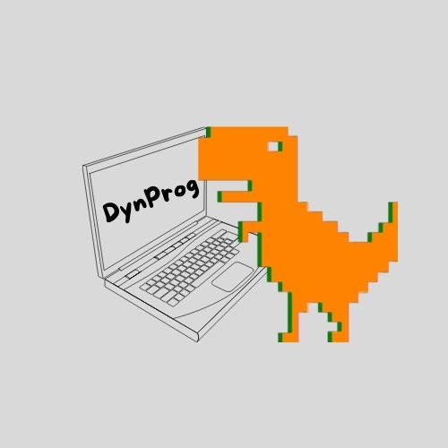

# DreamTeam - League Creator
## Developed by
* Dean Longmire: jlongmi9
* Juliana Broussard: jbrouss2
* Logan Bowers: lbower10
* Finli Hill: fhill5
* Ryan Carnes: rcarnes

## Project Logo

## Product Description
This is a website that is essentially a team manager for intramural/club sports. It will involve in depth stat tracking as well as team customization and game scheduling. This product will have the ability to draft fantasy teams as well. The goal of this project is to deliver a piece of software that is accessible to a wide variety of people including universities for intramural leagues, rec league organizers, or even for individual use amongst friends.

## Instructions for our Project
### How to Download
1. -

### How to Install 
1. -

### How to Run the Product
1. Open VS Code (or your -- of choice). 
2. In the terminal, type "npm start." 
3. Right click on index.html and launch with live server.

### How to Use the Product - Assuming you are a new user
1. Once you are on the home page, click "Create Account."
2. Enter the prompted information then click the "Create Account" button.
3. Now, you are brought to a set-up profile page where you can choose to enter more information.
4. After you click "Update Account," you are taken to your profile page. Here your information will be displayed.
5. You can edit your information by clicking "Edit my Information" and following steps 3-4 above.
6. Then you can click "View my Leagues and Teams" which will dropdown two options. 1: To view your teams 2. To view your leagues Since you are a new user, there will be links to creating a league or team.
7. Once you select either Join a League or Join a Team, you will be taken to the respective page that shows the current leagues and teams. You have the option to join these or create your own.
8. If you select create your own, you are prompted to 

## License Information
* Link to our license.txt file

© 2023 DynProg
